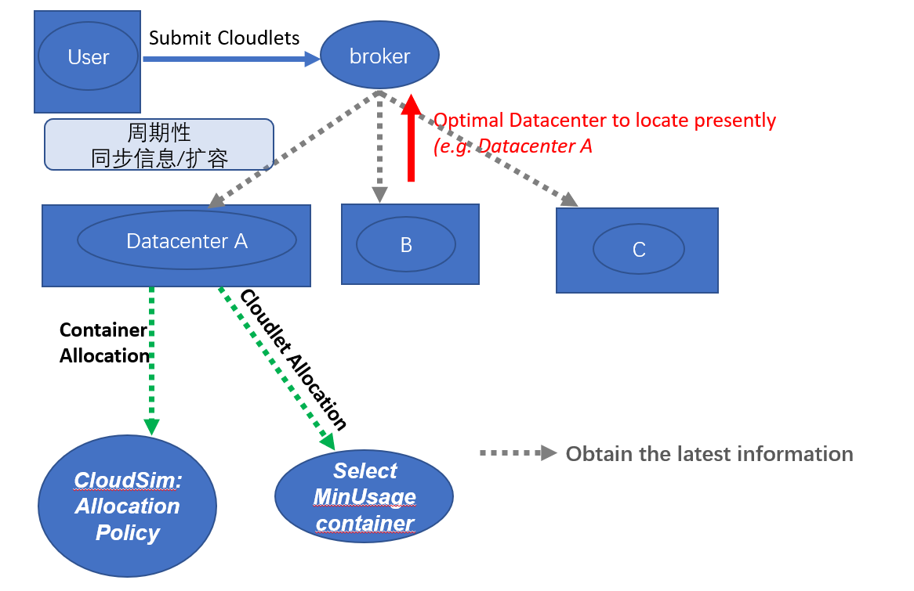
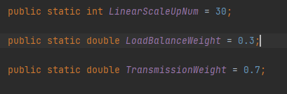

# CloudSim Plus #

本项目旨在CloudSim的基础上实现容器的扩容缩容，各层级的负载均衡，以制定用户侧长连接绑定延迟和服务商侧资源消耗的合理权衡方案。

#### 1、框架主体修改思路

明确实现目标：

- __扩容__，即在相应的时间节点生成容器创建的事件。
- __连接的动态绑定__，即没有指定绑定容器的连接在申请之后创建之前会由系统选取 ___合适___ 的容器对其进行绑定。

要实现的目标主要涉及到Datacenter之间、Datacenter与Broker之间，Datacenter内部的数据交互，所以CloudSim Plus主体设计了两个继承类_（两者都在CloudSim/src/main/java/org/cloudbus/cloudsim/container/core中）_：

- __UserSideBroker__ (继承_ContainerDatacenterBroker_)
- __UserSideDatacenter__(继承_PowerContainerDatacenter_)

如图1所示，使用CloudSim Plus的过程中，broker（代理）会周期性地向各个Datacenter发送探针并收集各个Datacenter的实时信息。通过分析收集到的信息，得到当前实施扩容的最优Allocation点（Variable _CurrentOptimalDatacenter_ in UserSideBroker ）并实施相应的扩容策略。

我们将这个周期性的过程称为同步（Synchronization）过程，在每次同步过程结束后，_CurrentOptimalDatacenter_ 将会收到之后的容器创建以及连接绑定的请求。其中，

- 容器创建的请求将会调用对应的ContainerAllocationPolicy

  （Default: _CloudSim/src/main/java/org/cloudbus/cloudsim/container/resourceAllocators/PowerContainerAllocationPolicySimple_）

- 连接绑定的请求在UserSideDatacenter中processCloudletBinding()方法中实现，首先在当前datacenter中筛选出可选的host，将可选host列表按照AvailableMIPS从大到小排序，使用包含__最大AvailableMIPS__的host作为连接的绑定的位置。

<center>    
        
    <br>    
    <div style="color:orange; border-bottom: 1px solid #d9d9d9;    display: inline-block;    color: #999;    padding: 2px;">图1：实体间通信思路</div> 
</center>

#### 2、 函数说明

- ```java
  class UserSideBroker extends ContainerDatacenterBroker{}
  ```

  - ```java
    submitCloudlets() //在连接未指定容器时，发送containerCloudSimTags.CLOUDLET_BINDING，延迟是clt.getExecStartTime()
    ```

  - ```java
    processDatacenterStatusUpdate(SimEvent ev)//在SynchronizationCount数量达到数据中心数量时，同步更新数据
    ```

  - ```java
    ProcessContainerScalabilitySync(SimEvent ev)//检查是否达到给定的时间间隔，如果未达到就等待；达到了就发送ack请求
    ```

  - ```java
    ProcessContainerScalabilityACK(SimEvent ev)//扩容的具体实现过程
    ```

  - ```java
    processCloudletReturn(SimEvent ev)//在连接完成之前实现自动缩容
    ```

- ```java
  class UserSideDatacenter extends PowerContainerDatacenter{}
  ```

  - ```java
    RemoveContainerFromDatacenter(SimEvent ev)//缩容时调用该函数对容器进行清除
    ```

  - ```java
    processCloudletBinding(SimEvent ev)//连接绑定容器的选取过程
    ```

  - ```java
    GetLatestDatacenterInfoAndSendBack(SimEvent ev)//收到broker发送的同步探针后收集该数据中心数据整理并发送给broker
    ```

  - ```java
    ContainerScalabilityCheck(SimEvent ev)//实现检查时间间隔的桥梁，多次触发。
    ```

#### 3、 示例代码

- 位置：

  _cloudsim/modules/cloudsim-examples/src/main/java/org/_

  _cloudbus/cloudsim/examples/container/ScalabilityAndLoadBalanceTest.java_

<center>    
        
    <br>    
    <div style="color:orange; border-bottom: 1px solid #d9d9d9;    display: inline-block;    color: #999;    padding: 2px;">图2：测试用例中的主要参数</div> 
</center>

<center>    
        
    <br>    
    <div style="color:orange; border-bottom: 1px solid #d9d9d9;    display: inline-block;    color: #999;    padding: 2px;">图2：测试用例中策略相关超参</div> 
</center>

- 输入输出均已可视化，负载统计分布周期性打印到日志中。